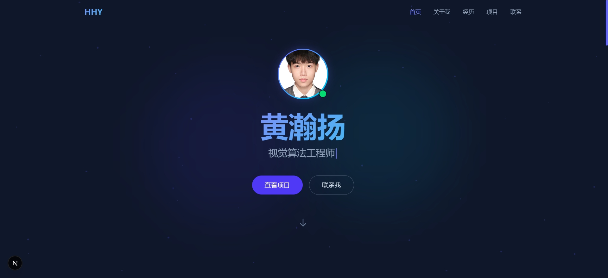

# V1.0 版本说明



**发布日期：** 2026-06-19  
**版本：** V1.0  
**分支：** V1.0

---

## 版本概述

黄瀚扬个人介绍网站 V1.0 首次正式发布。基于 Next.js 16 + React 19 + TypeScript 构建，包含完整的个人介绍、项目展示、联系方式等模块，支持响应式布局和丰富的交互动画。

---

## 功能清单

### 核心模块

| 模块 | 功能说明 |
|------|---------|
| 首屏 Hero | 个人头像（Next.js Image 优化）+ 打字机标语 + 粒子背景 + 渐变光晕 |
| 关于我 About | 个人介绍 + 技能进度条 + 滚动触发动画 |
| 经历 Experience | 时间线布局展示工作经历与教育背景 |
| 项目展示 Projects | 卡片悬浮交互 + 查看详情外链跳转 + 视频模态框播放 |
| 联系方式 Contact | 社交卡片（GitHub、Gitee、邮箱、微信、电话）+ 留言表单 |
| 页脚 Footer | 版权信息 + 社交链接 |

### 交互与动效

- 打字机效果（首屏标语循环切换）
- 粒子背景 + 渐变光晕
- 滚动触发淡入动画
- 技能进度条动画填充
- 卡片悬浮上浮 + 阴影
- 导航栏滚动高亮当前区域
- 头像边框呼吸光效
- 移动端汉堡菜单

### SEO 与性能优化

- Open Graph + Twitter Card 标签（社交分享卡片预览）
- JSON-LD 结构化数据（Google 富摘要）
- robots.txt + sitemap.xml（搜索引擎抓取）
- canonical URL（避免重复内容）
- Next.js `<Image>` 组件（自动压缩、WebP、懒加载、消除 CLS）
- metadataBase 集中管理

### 其他特性

- 局域网访问支持（`-H 0.0.0.0`）
- 跨平台运行（Windows / Ubuntu，移除平台锁定依赖）
- 站点配置集中管理（`src/config/site.ts`，改域名只需改一处）

---

## 技术栈

| 类别 | 技术 |
|------|------|
| 框架 | Next.js 16.2.9 (Turbopack) |
| 前端 | React 19.2.7 |
| 语言 | TypeScript 5.x |
| 样式 | Tailwind CSS 4.x |
| 字体 | Geist (Next.js 内置优化) |
| 包管理 | npm |

---

## 提交记录

| Commit | 类型 | 说明 |
|--------|------|------|
| `afe0ae8` | - | first commit（初始项目搭建） |
| `74052f0` | fix | 移除平台锁定依赖，支持跨平台运行 |
| `ce8083d` | feat | 添加SEO与性能优化 |
| `926604a` | docs | 更新README文档 |
| `2c1c6aa` | chore | 添加网站示例图 |

---

## 项目结构

```text
src/
├── app/
│   ├── globals.css       # 全局样式、CSS 变量、动画关键帧
│   ├── layout.tsx        # 根布局（SEO metadata、JSON-LD 结构化数据）
│   ├── page.tsx          # 主页面（组合所有模块）
│   └── sitemap.ts        # 站点地图（自动生成 sitemap.xml）
├── components/
│   ├── Navbar.tsx         # 顶部导航栏
│   ├── Hero.tsx           # 首屏英雄区
│   ├── About.tsx          # 关于我
│   ├── Experience.tsx     # 经历与教育
│   ├── Projects.tsx       # 项目展示
│   ├── Contact.tsx        # 联系方式
│   └── Footer.tsx         # 页脚
├── config/
│   └── site.ts            # 站点配置（域名、SEO、社交链接）
└── public/
    ├── avatar.png         # 个人头像
    ├── robots.txt         # 爬虫规则
    └── 网站示例图.jpg      # 网站截图
```

---

## 部署方式

### 开发模式

```bash
npm install
npm run dev    # http://localhost:3000
```

### 生产模式

```bash
npm install
npm run build
npm run start  # http://0.0.0.0:3000
```

### 服务器部署（Nginx 反向代理）

```nginx
server {
    listen 80;
    server_name huanghanyang345.xyz;

    location / {
        proxy_pass http://127.0.0.1:3000;
        proxy_http_version 1.1;
        proxy_set_header Upgrade $http_upgrade;
        proxy_set_header Connection 'upgrade';
        proxy_set_header Host $host;
        proxy_cache_bypass $http_upgrade;
    }
}
```

---

## 未来改进方向

- [ ] 添加深色/浅色主题切换
- [ ] 添加博客/文章模块
- [ ] 接入后端实现留言表单真实发送
- [ ] 添加项目详情页（独立路由）
- [ ] 添加 Google Analytics / 百度统计
- [ ] i18n 国际化支持
- [ ] PWA 支持
- [ ] 添加微信二维码图片展示
- [ ] 制作 1200×630 OG 专属预览图
- [ ] Docker 容器化部署
